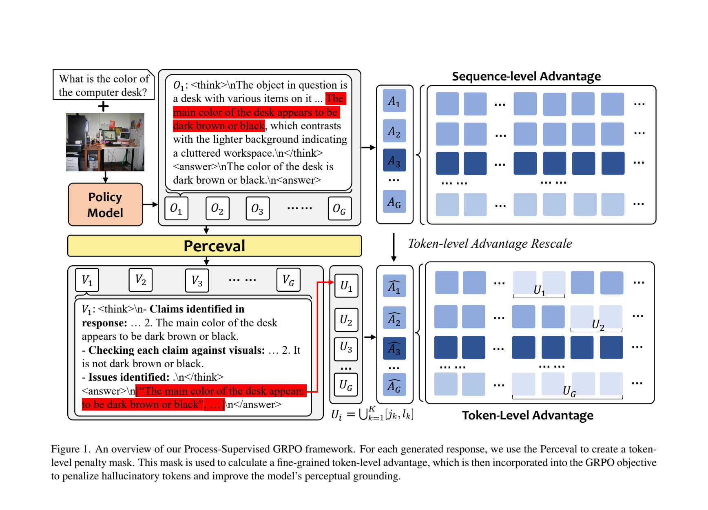
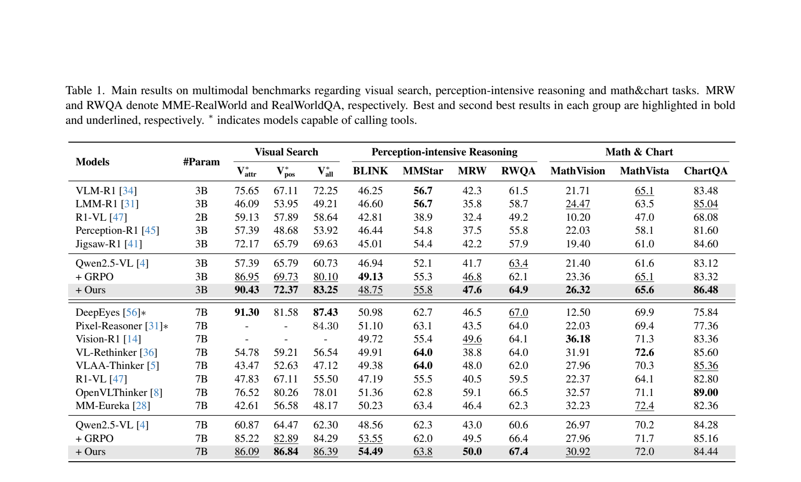
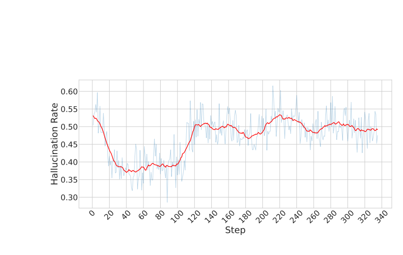
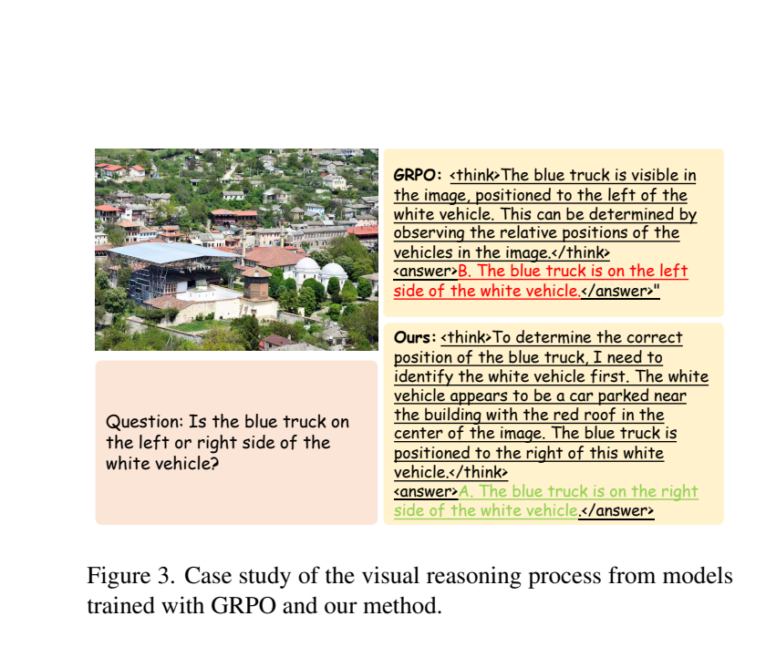

# Perceval: Perception-centric Process Reward Models for VLMs

Official training code for **[Improving Vision-language Models with Perception-centric Process Reward Models](https://openaccess.thecvf.com/content/CVPR2026/papers/Min_Improving_Vision-language_Models_with_Perception-centric_Process_Reward_Models_CVPR_2026_paper.pdf)** *(CVPR 2026)*.

Yingqian Min<sup>1,2 ∗</sup>, Kun Zhou<sup>3 ∗</sup>, Yifan Li<sup>1,2 ∗</sup>, Yuhuan Wu<sup>4</sup>, Han Peng<sup>1</sup>, Yifan Du<sup>1</sup>, Wayne Xin Zhao<sup>1 †</sup>, Min Yang<sup>2</sup>, Ji-Rong Wen<sup>1</sup>

<sup>1</sup>Gaoling School of Artificial Intelligence, Renmin University of China &nbsp; <sup>2</sup>Bytedance &nbsp; <sup>3</sup>UC San Diego &nbsp; <sup>4</sup>HKUST<br>
<sup>∗</sup>Equal contributions &nbsp; <sup>†</sup>Corresponding author

Built on top of [volcengine/verl](https://github.com/volcengine/verl); see [`NOTICE`](NOTICE) for attribution.

---

## TL;DR

RLVR for VLMs gives each token the same outcome-level reward, so the policy never learns which specific perceptual claim went wrong. **PERCEVAL** is a perception-centric Process Reward Model (PRM) that reads the response, grounds each claim against the image, and returns the *exact substrings* that hallucinate. We then convert those substrings into a token-level mask and rescale the GRPO advantage on those tokens only, replacing GRPO's sequence-level signal with a fine-grained, perception-aware credit-assignment.



```
Â'_{i,t} = Â_i − α · m_{i,t} · |Â_i|     (Eq. 3 in the paper, α = 0.1)
```

`m_{i,t} = 1` iff token *t* in response *i* falls inside a span PERCEVAL flagged as hallucinated. Correct tokens keep the original GRPO advantage; flagged tokens are downweighted (or pushed further negative when `Â_i < 0`).

## What this repository contains

```
perceval-open/
├── verl/                                      # vendored verl + Perceval additions
│   ├── trainer/ppo/core_algos.py              #   `trm` advantage estimator (Eq. 3)
│   ├── trainer/ppo/ray_trainer.py             #   penalty-mask construction from PERCEVAL spans
│   ├── workers/reward_manager/trm.py          #   threaded reward manager
│   └── utils/reward_score/hallu_token_reward_vstar.py
│                                              #   outcome (LLM-as-judge) + process (PERCEVAL) reward
├── perceval/                                  # Perceval-specific Python package
│   └── prompts/prompt_design.py               #   verifier prompt templates
├── examples/perceval/
│   ├── train/{3b,7b}_vstar_trm.sh             # policy RL training scripts
│   ├── train/_common.sh                       # shared bootstrap (loads configs/perceval.env)
│   └── serve/{serve_judge,serve_prm}.sh       # vLLM endpoints for the judge & PERCEVAL
├── configs/perceval.env.example               # all user-tunable paths and URLs
├── docs/DATA_PREPARATION.md                   # parquet schema + dataset sources
├── tests/, recipe/, scripts/                  # inherited from verl
└── LICENSE, NOTICE
```

The PRM training pipeline itself (query selection → rollout generation → automated annotation with a strong LLM → SFT on the structured `<answer>[…]</answer>` format) is described in §3.1 of the paper; this repo provides the RL training side. The released PRM weights below let you skip step 1-4 and go straight to training a policy.

## Pretrained checkpoints

| Checkpoint | Role | HuggingFace |
| --- | --- | --- |
| `perceval-prm-3b` | 3B PERCEVAL — perception-centric PRM | `<YOUR_HF_USER>/perceval-prm-3b` *(coming soon)* |
| `perceval-prm-7b` | 7B PERCEVAL — perception-centric PRM | `<YOUR_HF_USER>/perceval-prm-7b` *(coming soon)* |
| `perceval-policy-3b` | Qwen2.5-VL-3B-Instruct policy after Perceval-RL training | `<YOUR_HF_USER>/perceval-policy-3b` *(coming soon)* |
| `perceval-policy-7b` | Qwen2.5-VL-7B-Instruct policy after Perceval-RL training | `<YOUR_HF_USER>/perceval-policy-7b` *(coming soon)* |

The PRM's I/O contract is fully specified by `process_verify` / `extract_judgement_from_response` in [`verl/utils/reward_score/hallu_token_reward_vstar.py`](verl/utils/reward_score/hallu_token_reward_vstar.py). Any model that returns the same `<answer>[<sub-sentence>, ...]</answer>` format over an OpenAI-compatible endpoint can be substituted.

## Setup

```bash
conda create -n perceval python=3.10 -y && conda activate perceval
pip install -e .
pip install vllm openai math_verify filelock pyarrow tzdata
```

Copy and edit the example config:

```bash
cp configs/perceval.env.example configs/perceval.env
$EDITOR configs/perceval.env
```

Required variables: `PERCEVAL_MODEL_PATH`, `PERCEVAL_TRAIN_DATA`, `PERCEVAL_VAL_DATA`, `PERCEVAL_RESULTS_DIR`, `PERCEVAL_LOG_DIR`, `LLM_AS_A_JUDGE_BASE`, `PRM_BASE`.

## Data

The trainer expects parquet files with `images`, `prompt`, `reward_model.ground_truth`, and `extra_info` columns. Schema and pointers to the public sources (V\*, DeepEyes, MathVista, ViRL, …) are in [`docs/DATA_PREPARATION.md`](docs/DATA_PREPARATION.md). The repo does **not** ship parquet files.

**Note on data-source routing.** PERCEVAL only generates spans for rows whose `data_source` contains `vstar` (set in `adaptive_comput_score`). For non-perception rows (math, ViRL, etc.) the penalty mask is empty, so the `trm` advantage estimator mathematically degenerates to vanilla GRPO. This matches the *conditional strategy* described in §4.1 of the paper.

## End-to-end run

Open three terminals (or use `tmux`) on the same machine:

```bash
# Terminal 1: LLM-as-judge on GPU 0, port 9999
CUDA_VISIBLE_DEVICES=0 PORT=9999 \
  PERCEVAL_JUDGE_MODEL_PATH=Qwen/Qwen2.5-VL-7B-Instruct \
  bash examples/perceval/serve/serve_judge.sh

# Terminal 2: PERCEVAL PRM on GPU 1, port 12298 (launch more replicas if you can)
CUDA_VISIBLE_DEVICES=1 PORT=12298 \
  PERCEVAL_PRM_MODEL_PATH=<YOUR_HF_USER>/perceval-prm-7b \
  bash examples/perceval/serve/serve_prm.sh

# Terminal 3: trainer on GPUs 2-5 (3B run); use 7b_vstar_trm.sh on 8 GPUs for the 7B run
CUDA_VISIBLE_DEVICES=2,3,4,5 bash examples/perceval/train/3b_vstar_trm.sh
```

See [`examples/perceval/serve/README.md`](examples/perceval/serve/README.md) for multi-replica / multi-node setups.

## Key knobs

| Hydra key | Default | What it does |
| --- | --- | --- |
| `algorithm.adv_estimator` | `trm` | The Perceval advantage estimator. Setting it to `grpo` etc. falls back to upstream verl. |
| `+algorithm.penalty_percentage` | `0.1` | α in Eq. 3. The paper's ablation (Table 3) found `0.03` too weak, `0.3` over-penalizes, `0.1` optimal. |
| `+reward_model.reward_kwargs.verify_process` | `True` | Whether to call PERCEVAL at all. Set to `False` to ablate. |
| `+reward_model.reward_kwargs.max_workers` | `768` | Thread-pool size for parallel PERCEVAL/judge calls. |
| `custom_reward_function.path` | `verl/utils/reward_score/hallu_token_reward_vstar.py` | The reward function used. |

## Main results



Notable: at the 3B scale, gains are largest on V\*-positional (visual search), MATH-Vision, and ChartQA. At 7B, V\*-positional jumps by ~4 points and MATH-Vision by ~3. The paper's reading is that strengthening perceptual grounding generalizes to downstream tasks that depend on it — even though PRM supervision only fires on the perception-tagged subset of the training data. The 7B policy is also competitive with DeepEyes and surpasses Pixel-Reasoner on visual search, despite not relying on external image-manipulation tools.

### No reward hacking

A common failure mode of reward-model-driven RL is the policy gaming the reward signal — the loss keeps going down without genuine quality gains. Because PERCEVAL doesn't emit a scalar reward but instead localizes spans, gaming it would require *hiding* hallucinations from a strong VLM verifier, which is much harder.

Empirically, the hallucination rate that PERCEVAL flags during training falls early on and then *plateaus* — exactly what you'd expect when the policy is genuinely improving but cannot fool the verifier indefinitely (Figure 2 in the paper):



### Qualitative example

A spatial-relation question where the GRPO baseline blurts an answer with no grounding while the Perceval-trained model first locates each vehicle then deduces their relative position (Figure 3 in the paper):



## Test-time scaling

PERCEVAL also drives two inference-time refinement loops (Table 2):

- **Truncate–then–Regenerate**: truncate the response before the first flagged token and resample.
- **Truncate–Thinking–then–Regenerate**: as above, but inject a short reflective prompt before resampling.

At k=16 samples, Truncate hits V\* = 89.53 / BLINK = 49.45 vs. majority voting's 85.86 / 48.41.

## Citation

```bibtex
@inproceedings{perceval2026,
  title     = {Improving Vision-language Models with Perception-centric Process Reward Models},
  author    = {Yingqian Min and Kun Zhou and Yifan Li and Yuhuan Wu and Han Peng and Yifan Du and Wayne Xin Zhao and Min Yang and Ji-Rong Wen},
  booktitle = {Proceedings of the IEEE/CVF Conference on Computer Vision and Pattern Recognition (CVPR)},
  year      = {2026}
}
```

## License

Apache License 2.0. See [`LICENSE`](LICENSE). This work is derived from
[verl](https://github.com/volcengine/verl) (Apache 2.0); [`NOTICE`](NOTICE)
enumerates the Perceval-specific modifications.

## Acknowledgments

This work was partially supported by the National Natural Science Foundation of China No. 92470205 and Beijing Major Science and Technology Project No. Z251100008425002.
